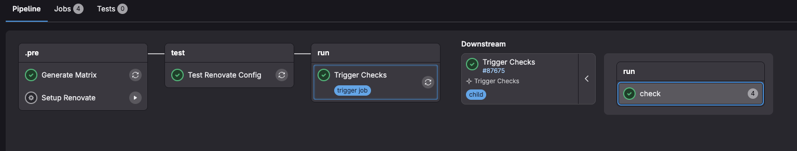
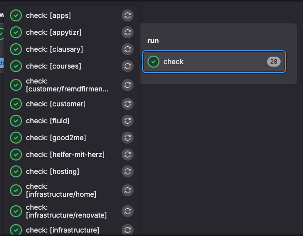
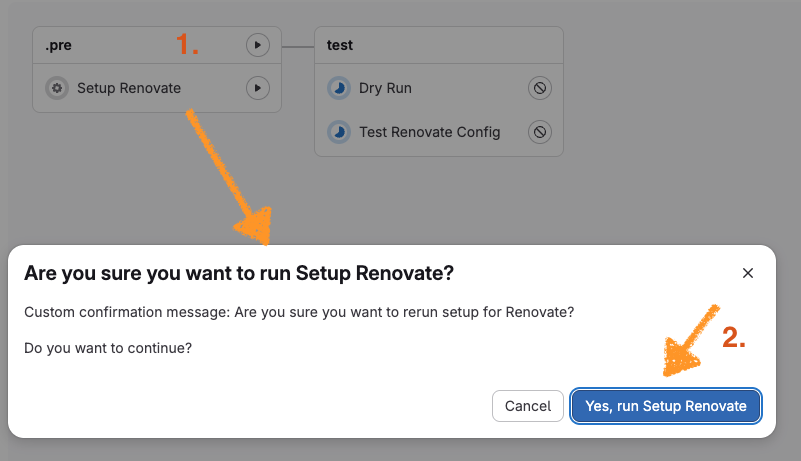

# Renovate

Setup Renovate Runner within Gitlab:

```yaml
include:
  - component: $CI_SERVER_FQDN/$CI_PROJECT_PATH/runner@<VERSION>

stages: [build, test, run]
```

To improve scaling in bigger project use

```yaml
include:
  - component: $CI_SERVER_FQDN/$CI_PROJECT_PATH/runner-autoscale@<VERSION>

stages: [build, test, run]
```

This template reads groups of Renovate Gitlab User and builds the checks dynamic:



For each group the last leaf is used and then the check iterates the projects in each group to reduce overall runtime via parallel runs:



Add a `config.js` in the project. e.g:
```js
module.exports = {
  token: process.env.GITHUB_COM_TOKEN,
  hostRules: [
    {
      hostType: 'maven',
      matchHost: process.env.CI_SERVER_HOST,
      token: process.env.RENOVATE_TOKEN,
    },
    {
      hostType: 'docker',
      matchHost: process.env.CI_REGISTRY,
      username: 'ci',
      password: process.env.RENOVATE_TOKEN,
    },
  ],
  registryAliases:{
    "$CI_REGISTRY": process.env.CI_REGISTRY,
    "$CI_SERVER_FQDN": process.env.CI_SERVER_FQDN,
    "$CI_SERVER_HOST": process.env.CI_SERVER_FQDN
  },
  forkProcessing: 'enabled',
  platformAutomerge: true,
  autodiscover: true,
  allowScripts: true,
  exposeAllEnv: true,
  persistRepoData: true
};
```
Add the following Tokens as CI/CD:

* `RENOVATE_TOKEN` - Gitlab PAT for Renovate user, can be omitted with Service Accounts, see [##Setup](setup).
* `GITHUB_TOKEN` - Github access token to omit api rate limit errors

If you want to customize `Dry Run` just overwrite:

```
include:
  - component: $CI_SERVER_FQDN/components/renovate/runner-template@<VERSION>

stages: [test, deploy]

Dry Run:
  variables:
    # limit dry run to a filter
    RENOVATE_AUTODISCOVER_FILTER: '...'
```

## Migrating the bot user

Renovate's GitLab platform locates its *Dependency Dashboard* by scanning only
issues **created by the currently authenticated user**. When the bot user
changes — a username change, or an access-token rotation that spawns a
brand-new service-account user — the new user cannot see the old dashboard, so
Renovate opens a fresh one and the previous dashboard is orphaned. The result is
duplicate dashboards across your projects.

The `user-migrator` component adds a manual job that closes the orphaned
dashboards and keeps the one the current bot owns:

```yaml
include:
  - component: $CI_SERVER_FQDN/$CI_PROJECT_PATH/user-migrator@<VERSION>
    inputs:
      # group id or full path to scan (incl. subgroups)
      group: my-group
      # username of the CURRENT bot; every other dashboard in a project
      # that has duplicates is closed (robust for token rotation)
      keep_author: gitlab_renovate_bot
      # flip to true once the dry-run output looks right
      execute: false

stages: [run]
```

The job is a **dry-run by default** and prints exactly what it would close; set
`execute: true` to act. It only touches projects that have more than one open
dashboard (override with `allow_single: true`) and never closes the last
remaining dashboard (override with `force_close_all: true`).

Instead of `keep_author` you can pass `close_author` with a comma-separated list
of the old bot username(s) to close explicitly. The token used is read from the
CI/CD variable named by `token_variable` (default `RENOVATE_TOKEN`) and must
belong to the current bot with `api` scope. Use `scope: projects` with
`projects: a/b,c/d` or `scope: all-membership` to change how target projects are
discovered.

## Setup

If your Gitlab license allows creation of service accounts you can run the manual job `Setup Renovate`.
Just add the desired group id where the service account should be created via `variables`:
```
    SERVICEACCOUNT_GROUP_ID: ...
```

By default the `$CI_JOB_TOKEN` is used. To adjust assign to variable `$GITLAB_TOKEN`:

```
Setup Renovate:
  variables:
    SERVICEACCOUNT_GROUP_ID: ...
    GITLAB_TOKEN: $CI_JOB_TOKEN
```

Then run the manual job:



Then check the job output. It should look like this:
```
Login to GitLab CLI (gitlab.com)...
WARNING: One of GITLAB_TOKEN, GITLAB_ACCESS_TOKEN, OAUTH_TOKEN environment variables is set. If you don't want to use it for glab, unset it.
Creating service account gitlab_renovate_bot in group 117849439 ...
Created service account with id 31667576
Setting CI/CD variable in project
Created variable RENOVATE_TOKEN for cloudtooling/renovate with scope *.
```

On default it adds a CI/CD variable `RENOVATE_TOKEN` in the current Gitlab Job which is used by the CI/CD component. You can use this Account to add project to renovate.